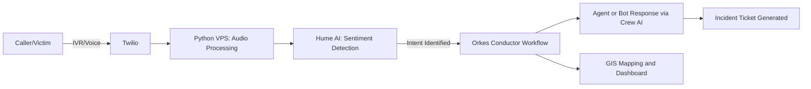

# **DisasterAI-CallCenter 🚑**

An **AI-powered disaster response call center system** designed to streamline emergency support through **multi-channel communication, sentiment analysis, crisis prediction, and intelligent routing.** This project leverages **Twilio**, **Hume AI**, **Crew AI**, and **Orkes Conductor** to handle high-stress situations effectively and provide real-time assistance during disasters.

---

## **Table of Contents**

- [Overview](#overview)
- [Features](#features)
- [Architecture](#architecture)
- [Technologies Used](#technologies-used)
- [Installation](#installation)
- [Configuration](#configuration)
- [Crew AI Setup](#crew-ai-setup)
- [Usage](#usage)
- [Workflows](#workflows)
- [Dashboard](#dashboard)
- [File Structure](#file-structure)
- [Contributing](#contributing)
- [License](#license)

---

## **Overview**

During emergencies, timely and accurate communication can save lives. **DisasterAI-CallCenter** provides an **AI-driven multi-channel support system** to:

1. **Handle incoming calls and messages** from various platforms (IVR, WhatsApp, SMS).
2. **Analyze sentiment** and **route calls dynamically** to reduce response time.
3. Provide **real-time dashboards** to monitor incidents and coordinate response teams.
4. Ensure **data integrity** with blockchain and **early warnings** using IoT and social media feeds.

---

## **Features**

- **Multi-Channel Support**: Handles voice, SMS, WhatsApp, and chat interactions seamlessly.
- **AI-Powered Sentiment Analysis**: Detects emotions (stress, fear) and escalates high-risk cases automatically.
- **Intelligent Call Routing**: Routes calls based on sentiment, intent detection, and workload.
- **Automated Information Extraction**: Extracts key details (location, emergency type) in real-time for mapping.
- **Real-Time Dashboards**: Visual monitoring with GIS integration and IoT feeds.
- **Voice Cloning**: Uses AI-generated voices for familiar announcements.
- **Proactive Alerts**: Predicts and sends early warnings for emerging crises.

---

## **Architecture**



1. **Twilio**: Manages phone calls, SMS, WhatsApp messages.
2. **Hume AI**: Detects emotional states to prioritize response.
3. **Orkes Conductor**: Coordinates workflows for case management.
4. **Crew AI**: Manages communication between multiple agents.
5. **GIS and Dashboard**: Monitors incidents visually for real-time updates.

---

## **Technologies Used**

- **Python**: Core logic and backend processes.
- **Twilio API**: Communication and call management.
- **Hume AI**: Sentiment analysis and emotion detection.
- **Crew AI**: Multi-agent collaboration and load balancing.
- **Orkes Conductor**: Workflow management.
- **Flask/Django**: Dashboard web application.
- **GAN Models**: Audio cleaning and enhancement.

---

## **Installation**

### 1. **Clone the Repository**

```bash
git clone https://github.com/your-username/DisasterAI-CallCenter.git
cd DisasterAI-CallCenter
```

### 2. **Create a Virtual Environment**

```bash
python -m venv venv
source venv/bin/activate  # On Windows: venv\Scripts\activate
```

### 3. **Install Dependencies**

```bash
pip install -r requirements.txt
```

---

## **Crew AI Setup**

This project uses **[Crew AI](https://crewai.com)** to coordinate multiple agents working together.

### **Prerequisites**

Ensure **Python 3.10 to 3.13** is installed on your system.

### **Install `uv` for Dependency Management**

```bash
pip install uv
```

### **Install Crew AI Dependencies**

In the project root directory, run:

```bash
crewai install
```

### **Configuration for Crew AI**

1. **Add your `OPENAI_API_KEY` to the `.env` file.**
2. Modify the following configuration files:
   - `src/call_center/config/agents.yaml`: Define your agents.
   - `src/call_center/config/tasks.yaml`: Define your tasks.
   - `src/call_center/crew.py`: Customize logic, tools, and args.
   - `src/call_center/main.py`: Add custom inputs for agents and tasks.

### **Run the Crew AI System**

To initiate your agents and begin task execution:

```bash
crewai run
```

By default, this will create a `report.md` file in the root folder with the outcome of a research task.

---

## **Configuration**

1. **Twilio**: Configure Twilio to forward calls to your Python VPS endpoint.
2. **Hume AI**: Add API keys to **config/hume_config.json**.
3. **Orkes Conductor**: Import workflows to the Orkes dashboard.
4. **Crew AI**: Use `agents.yaml` and `tasks.yaml` to define agent behavior.
5. **Flask Dashboard**: Configure **dashboard/app.py** for monitoring.

---

## **Usage**

1. **Start the Call Center System**:

   ```bash
   python src/main.py
   ```

2. **Receive Calls or Messages**:  
   Twilio triggers **src/routes/twilio_webhook.py**, which processes inputs.

3. **Sentiment Detection and Routing**:  
   Audio is cleaned with **GAN models** and analyzed with **Hume AI** for sentiment detection. **Orkes Conductor** manages workflows based on intent or emotion.

4. **Monitor via Dashboard**:  
   Start the dashboard using:
   ```bash
   python dashboard/app.py
   ```
   Access it at `http://localhost:5000`.

---

## **Workflows**

- **Call Routing Workflow**: Routes calls dynamically based on sentiment.
- **Escalation Workflow**: Escalates high-risk calls to human agents.

Workflows are defined in **src/workflows/** and managed via **Orkes Conductor**.

---

## **Dashboard**

The **dashboard** provides live monitoring of ongoing incidents, agent statuses, and case reports.

- **Visualize GIS-mapped emergencies.**
- **Monitor IoT alerts in real-time.**
- **Track case resolution status.**

---

## **File Structure**

```
DisasterAI-CallCenter/
│
├── config/                   # Configuration files
├── src/                      # Core source code
├── models/                   # AI models
├── docs/                     # Documentation
├── tests/                    # Test cases
├── data/                     # Sample data for testing
├── dashboard/                # Web dashboard
└── README.md                 # Project overview
```

---

## **Contributing**

We welcome contributions!

1. **Fork** the repository.
2. **Create a new branch**:
   ```bash
   git checkout -b feature-new-feature
   ```
3. **Commit your changes**:
   ```bash
   git commit -m "Added a new feature"
   ```
4. **Push to the branch**:
   ```bash
   git push origin feature-new-feature
   ```
5. **Create a Pull Request** on GitHub.

---

## **License**

This project is licensed under the **MIT License** – see the **LICENSE** file for details.

---

## **Support**

For questions or feedback:

- **Crew AI Documentation**: [docs.crewai.com](https://docs.crewai.com)
- **GitHub Repository**: [Crew AI on GitHub](https://github.com/joaomdmoura/crewai)
- **Discord**: [Join our community](https://discord.com/invite/X4JWnZnxPb)
- **Chat with our Docs**: [Ask a Question](https://chatg.pt/DWjSBZn)

---

Let’s build a safer world together with the power of **AI** and **collaborative agents**!
